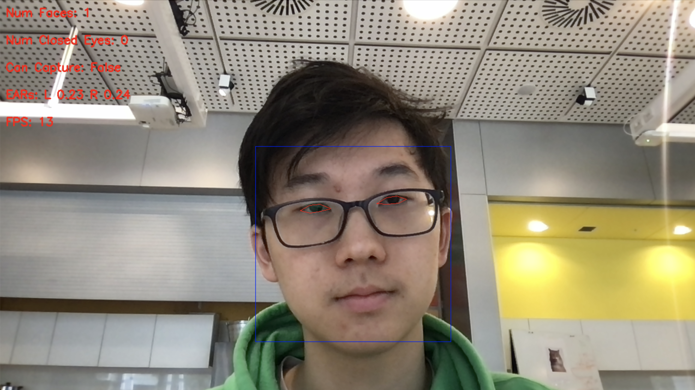
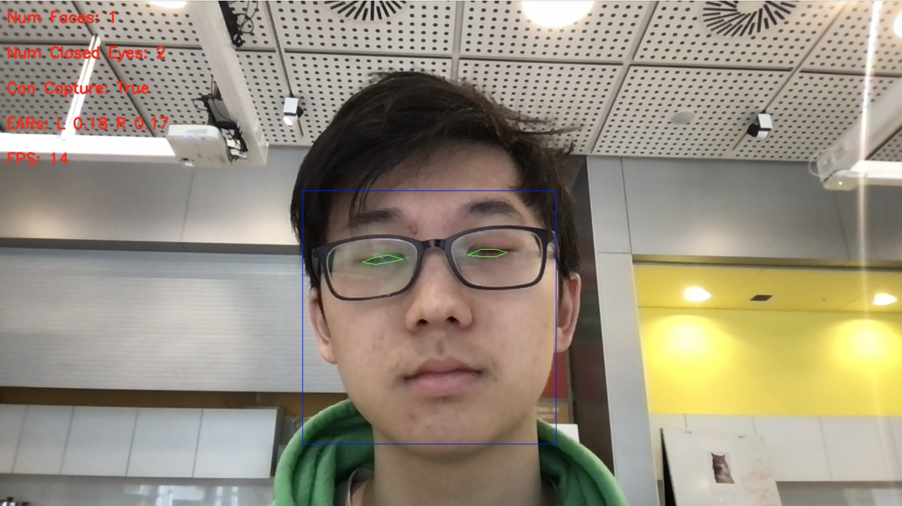
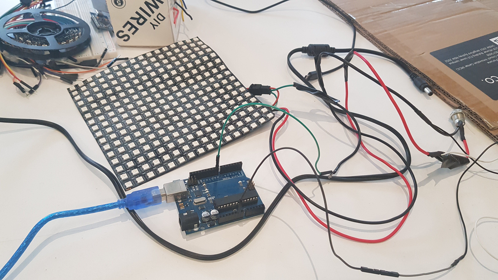

# Blink Camera
**A camera that only takes photos when your eyes are closed!**

Built by Bianca Ren, Cameron McDonald, and Chris Yoo.
**Winner - Peak of Pointlessness award** in the Terrible Ideas Hackathon 2024 @ UNSW.

### Video Processor (Python & OpenCV)
To detect when the subject's eyes are closed, we used a Python script to process a video feed from the laptop's camera and take photos when all eyes in the shot are closed.

We have used OpenCV, the `dlib` library and a facial landmark predictor model to find faces in the portrait, and within each face, check the Eye Aspect Ratio (EAR; a ratio of the horizontal length of the eye to the vertical length, i.e. a smaller EAR corresponds to a closed eye).

Upon taking the photo, the image is uploaded to an AWS S3 bucket, where the photos are served to the frontend.

Credits to [this repo](https://github.com/nicoTrombon/facial-landmarks/tree/master) for the code for facial recognition.

Eyes open

Eyes closed

### Frontend (React & Material UI)
To cause maximal public shaming, we have created a public gallery of all photos taken where anyone on the Internet can view, download, and laugh at pictures of themselves.
This is hosted on AWS Amplify, and available at: https://master.d3iee95gvbltma.amplifyapp.com/.

### Arduino (C++ & Circuitry)
To cause involuntary blinking of eyes, we have hooked up our laptop to an Arduino which controls a bright LED panel. The flashes trigger at random intervals to stimulate eye closure.

